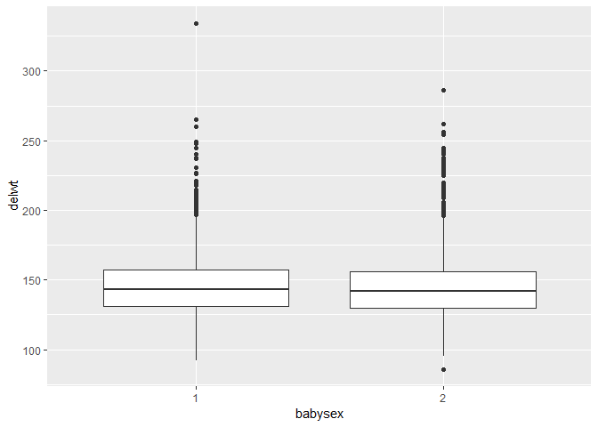
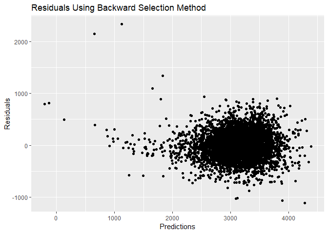
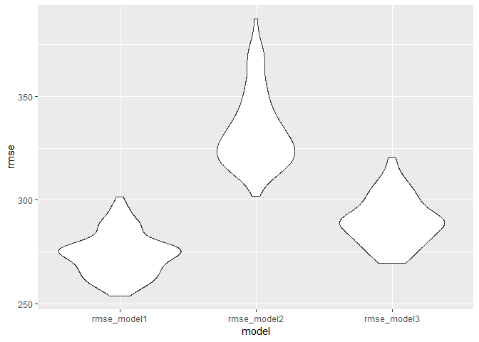

Data Science I - Homework 6
================
Sunny Siddique
November 24, 2018

Problem 1
=========

Create a city\_state variable (e.g. “Baltimore, MD”), and a binary variable indicating whether the homicide is solved. Omit cities Dallas, TX; Phoenix, AZ; and Kansas City, MO – these don’t report victim race. Also omit Tulsa, AL – this is a data entry mistake. Modifiy victim\_race to have categories white and non-white, with white as the reference category. Be sure that victim\_age is numeric.

``` r
#Loading the dataset and naming it homicide_data
homicide_data = read_csv("./homicide-data.csv") %>% 
  janitor::clean_names()
```

    ## Parsed with column specification:
    ## cols(
    ##   uid = col_character(),
    ##   reported_date = col_integer(),
    ##   victim_last = col_character(),
    ##   victim_first = col_character(),
    ##   victim_race = col_character(),
    ##   victim_age = col_character(),
    ##   victim_sex = col_character(),
    ##   city = col_character(),
    ##   state = col_character(),
    ##   lat = col_double(),
    ##   lon = col_double(),
    ##   disposition = col_character()
    ## )

``` r
#Creating city_state variable, binary variable for solved cases, omitting certain cities, modifying victim race and converting victim_age as numeric.
homicide_clean = homicide_data %>% 
  mutate(city_state = str_c(city, state, sep = ", "),
         solved = as.numeric (disposition == "Closed by arrest")) %>% 
  filter(!city_state %in% c("Dallas, TX","Phoenix, AZ", "Kansas City, MO", "Tulsa, AL")) %>% 
  mutate (victim_race = recode(victim_race, "White" = "white", "Hispanic" = "non-white", "Other" = "non-white", "Black" = "non-white", "Asian" = "non-white")) %>% 
  mutate(victim_race = fct_relevel(victim_race, "white")) %>% 
  mutate(victim_age = as.numeric(victim_age))
```

    ## Warning in evalq(as.numeric(victim_age), <environment>): NAs introduced by
    ## coercion

``` r
#Confirming that victim_age was converted correctly
class(homicide_clean$victim_age)
```

    ## [1] "numeric"

For the city of Baltimore, MD, use the glm function to fit a logistic regression with resolved vs unresolved as the outcome and victim age, sex and race (as just defined) as predictors. Save the output of glm as an R object; apply the broom::tidy to this object; and obtain the estimate and confidence interval of the adjusted odds ratio for solving homicides comparing non-white victims to white victims keeping all other variables fixed.

``` r
#Creating dataset and regression for "Baltimore"
baltimore_logistic = homicide_clean %>% 
  filter(city_state == "Baltimore, MD") %>% 
  glm(solved ~ victim_age + victim_sex + victim_race, data = ., family = binomial())
baltimore_logistic
```

    ## 
    ## Call:  glm(formula = solved ~ victim_age + victim_sex + victim_race, 
    ##     family = binomial(), data = .)
    ## 
    ## Coefficients:
    ##          (Intercept)            victim_age        victim_sexMale  
    ##              1.18603              -0.00699              -0.88779  
    ## victim_racenon-white  
    ##             -0.81960  
    ## 
    ## Degrees of Freedom: 2826 Total (i.e. Null);  2823 Residual
    ## Null Deviance:       3676 
    ## Residual Deviance: 3597  AIC: 3605

``` r
#Computing confidence intervals
baltimore_logistic %>% 
  broom::tidy() %>% 
  mutate(OR = exp(estimate),
         lower_bound = exp(estimate - std.error*1.96), upper_bound = exp(estimate + std.error*1.96))
```

    ## # A tibble: 4 x 8
    ##   term estimate std.error statistic  p.value    OR lower_bound upper_bound
    ##   <ch>    <dbl>     <dbl>     <dbl>    <dbl> <dbl>       <dbl>       <dbl>
    ## 1 (In~  1.19      0.235        5.06 4.30e- 7 3.27        2.07        5.19 
    ## 2 vic~ -0.00699   0.00326     -2.14 3.22e- 2 0.993       0.987       0.999
    ## 3 vic~ -0.888     0.136       -6.53 6.80e-11 0.412       0.315       0.537
    ## 4 vic~ -0.820     0.175       -4.69 2.68e- 6 0.441       0.313       0.620

*The odds of a non-white person's case being solved is 0.441 times the odds of a white person's case being solved. We are 95% confident that the true odds ratio falls between 0.313 and 0.620.*

Now run glm for each of the cities in your dataset, and extract the adjusted odds ratio (and CI) for solving homicides comparing non-white victims to white victims. Do this within a “tidy” pipeline, making use of purrr::map, list columns, and unnest as necessary to create a dataframe with estimated ORs and CIs for each city.

``` r
#GLM for all cities
all_cities = homicide_clean %>% 
  group_by(city_state) %>% 
  nest() %>% 
  mutate(cities = map(data, ~glm(solved ~ victim_age + victim_sex + victim_race, data = .x, family = binomial())),
    cities = map(cities, broom::tidy)) %>% 
   select(-data) %>% 
  unnest() %>% 
  filter(term == "victim_racenon-white") %>% 
  mutate(OR = exp(estimate),
         conf_low = exp(estimate - std.error*1.96),
         conf_high = exp(estimate + std.error*1.96)) %>%
  select(city_state, term, log_OR = estimate, OR, conf_low, conf_high, p.value)
```

Create a plot that shows the estimated ORs and CIs for each city. Organize cities according to estimated OR, and comment on the plot.

``` r
all_cities %>% 
  mutate(city_state = fct_reorder(city_state, OR)) %>%
  ggplot(aes(x = city_state, y = OR)) + geom_point() +
  geom_errorbar(mapping = aes(ymin = conf_low, ymax = conf_high)) +
  theme(axis.text.x = element_text(angle = 90, hjust = 1)) +
  labs (
    title = "Estimated ORs and CIs",
        x = "City",
        y = "Estimate"
  )
```


*It appears that in cities like Boston, Omaha, Oakland, Pittsburgh etc. the odds of having the case resolved for a non-white person is statistially significantly lower compared to a white person. For cities on the other end, such as Tampa, Birmingham, Durham the estimate suggests that there is not much disparity in the odds of having the case resolved between a non-white and white person; however, these estimates are not statistically significant at the 5% level of significance, because their 95% confidence interval error bars include the null value of 1.*

Problem 2
=========

Load and clean the data for regression analysis (i.e. convert numeric to factor where appropriate, check for missing data, etc.).

``` r
#Loading the dataset
birthweight = read_csv("./birthweight.csv") %>% 
  janitor::clean_names()
```

    ## Parsed with column specification:
    ## cols(
    ##   .default = col_integer(),
    ##   gaweeks = col_double(),
    ##   ppbmi = col_double(),
    ##   smoken = col_double()
    ## )

    ## See spec(...) for full column specifications.

``` r
#Checking the class of all variables to identify which ones need to be converted
sapply(birthweight, class)
```

    ##   babysex     bhead   blength       bwt     delwt   fincome     frace 
    ## "integer" "integer" "integer" "integer" "integer" "integer" "integer" 
    ##   gaweeks   malform  menarche   mheight    momage     mrace    parity 
    ## "numeric" "integer" "integer" "integer" "integer" "integer" "integer" 
    ##   pnumlbw   pnumsga     ppbmi      ppwt    smoken    wtgain 
    ## "integer" "integer" "numeric" "integer" "numeric" "integer"

*Need to convert babysex, malform, frace, mrace from numeric to factor.*

``` r
#Mutating select variables
birthweight = birthweight %>% 
  mutate(babysex = as.factor(babysex), 
         malform = as.factor (malform),
         frace = as.factor(frace), 
         mrace = as.factor(mrace))
```

``` r
#Looking for missing values 
sapply(birthweight, function(x) sum(is.na(x)))
```

    ##  babysex    bhead  blength      bwt    delwt  fincome    frace  gaweeks 
    ##        0        0        0        0        0        0        0        0 
    ##  malform menarche  mheight   momage    mrace   parity  pnumlbw  pnumsga 
    ##        0        0        0        0        0        0        0        0 
    ##    ppbmi     ppwt   smoken   wtgain 
    ##        0        0        0        0

*No missing values in the dataset.*

Propose a regression model for birthweight. This model may be based on a hypothesized structure for the factors that underly birthweight, on a data-driven model-building process, or a combination of the two. Describe your modeling process and show a plot of model residuals against fitted values – use add\_predictions and add\_residuals in making this plot.

Exploring the relationship between birthweight and mother's weight at delivery.

``` r
ggplot(birthweight, aes(babysex, delwt)) + geom_boxplot()
```



Backward selection

``` r
birthweight %>% 
  lm(bwt ~ babysex + bhead + blength + delwt + fincome + frace + gaweeks + malform + menarche + mheight + mrace + momage +parity + pnumlbw + pnumsga +ppbmi + ppwt + smoken + wtgain, data = .) %>% 
  broom::tidy() %>% 
  knitr::kable(digits = 3)
```

| term        |   estimate|  std.error|  statistic|  p.value|
|:------------|----------:|----------:|----------:|--------:|
| (Intercept) |  -6265.391|    660.401|     -9.487|    0.000|
| babysex2    |     28.707|      8.465|      3.391|    0.001|
| bhead       |    130.778|      3.452|     37.881|    0.000|
| blength     |     74.954|      2.022|     37.075|    0.000|
| delwt       |      4.101|      0.395|     10.386|    0.000|
| fincome     |      0.290|      0.180|      1.614|    0.107|
| frace2      |     14.331|     46.150|      0.311|    0.756|
| frace3      |     21.236|     69.296|      0.306|    0.759|
| frace4      |    -46.996|     44.678|     -1.052|    0.293|
| frace8      |      4.297|     74.074|      0.058|    0.954|
| gaweeks     |     11.549|      1.465|      7.882|    0.000|
| malform1    |      9.765|     70.626|      0.138|    0.890|
| menarche    |     -3.551|      2.895|     -1.226|    0.220|
| mheight     |      9.787|     10.312|      0.949|    0.343|
| mrace2      |   -151.435|     46.045|     -3.289|    0.001|
| mrace3      |    -91.387|     71.919|     -1.271|    0.204|
| mrace4      |    -56.479|     45.137|     -1.251|    0.211|
| momage      |      0.759|      1.222|      0.621|    0.534|
| parity      |     95.541|     40.479|      2.360|    0.018|
| ppbmi       |      4.354|     14.891|      0.292|    0.770|
| ppwt        |     -3.472|      2.612|     -1.329|    0.184|
| smoken      |     -4.854|      0.587|     -8.269|    0.000|

``` r
#Eliminate frace because p>0.05 for all levels

birthweight %>% 
  lm(bwt ~ babysex + bhead + blength + delwt + fincome + gaweeks + malform + menarche + mheight + mrace + momage +parity + pnumlbw + pnumsga +ppbmi + ppwt + smoken + wtgain, data = .) %>% 
  broom::tidy() %>% 
  knitr::kable(digits = 3)
```

| term        |   estimate|  std.error|  statistic|  p.value|
|:------------|----------:|----------:|----------:|--------:|
| (Intercept) |  -6275.754|    660.106|     -9.507|    0.000|
| babysex2    |     28.677|      8.462|      3.389|    0.001|
| bhead       |    130.796|      3.450|     37.914|    0.000|
| blength     |     74.912|      2.021|     37.075|    0.000|
| delwt       |      4.100|      0.395|     10.392|    0.000|
| fincome     |      0.290|      0.179|      1.619|    0.106|
| gaweeks     |     11.565|      1.465|      7.895|    0.000|
| malform1    |      9.860|     70.604|      0.140|    0.889|
| menarche    |     -3.612|      2.892|     -1.249|    0.212|
| mheight     |      9.975|     10.307|      0.968|    0.333|
| mrace2      |   -137.203|     10.215|    -13.432|    0.000|
| mrace3      |    -73.858|     42.789|     -1.726|    0.084|
| mrace4      |    -99.158|     19.386|     -5.115|    0.000|
| momage      |      0.755|      1.221|      0.618|    0.536|
| parity      |     95.667|     40.468|      2.364|    0.018|
| ppbmi       |      4.563|     14.884|      0.307|    0.759|
| ppwt        |     -3.508|      2.611|     -1.344|    0.179|
| smoken      |     -4.828|      0.586|     -8.239|    0.000|

``` r
#Eliminate fincome because p>0.05

birthweight %>% 
  lm(bwt ~ babysex + bhead + blength + delwt + gaweeks + malform + menarche + mheight + mrace + momage +parity + pnumlbw + pnumsga +ppbmi + ppwt + smoken + wtgain, data = .) %>% 
  broom::tidy() %>% 
  knitr::kable(digits = 3)
```

| term        |   estimate|  std.error|  statistic|  p.value|
|:------------|----------:|----------:|----------:|--------:|
| (Intercept) |  -6300.840|    660.047|     -9.546|    0.000|
| babysex2    |     28.604|      8.464|      3.379|    0.001|
| bhead       |    130.997|      3.448|     37.990|    0.000|
| blength     |     74.786|      2.019|     37.033|    0.000|
| delwt       |      4.092|      0.395|     10.371|    0.000|
| gaweeks     |     11.612|      1.465|      7.927|    0.000|
| malform1    |      7.447|     70.602|      0.105|    0.916|
| menarche    |     -3.871|      2.888|     -1.340|    0.180|
| mheight     |     10.510|     10.303|      1.020|    0.308|
| mrace2      |   -142.057|      9.767|    -14.545|    0.000|
| mrace3      |    -78.189|     42.713|     -1.831|    0.067|
| mrace4      |   -103.341|     19.217|     -5.378|    0.000|
| momage      |      1.184|      1.192|      0.994|    0.320|
| parity      |     93.366|     40.450|      2.308|    0.021|
| ppbmi       |      5.002|     14.884|      0.336|    0.737|
| ppwt        |     -3.586|      2.611|     -1.374|    0.170|
| smoken      |     -4.852|      0.586|     -8.281|    0.000|

``` r
#Eliminate malform1 because p>0.05

birthweight %>% 
  lm(bwt ~ babysex + bhead + blength + delwt + gaweeks + menarche + mheight + mrace + momage +parity + pnumlbw + pnumsga +ppbmi + ppwt + smoken + wtgain, data = .) %>% 
  broom::tidy() %>% 
  knitr::kable(digits = 3)
```

| term        |   estimate|  std.error|  statistic|  p.value|
|:------------|----------:|----------:|----------:|--------:|
| (Intercept) |  -6300.002|    659.924|     -9.547|    0.000|
| babysex2    |     28.590|      8.462|      3.379|    0.001|
| bhead       |    131.000|      3.448|     37.996|    0.000|
| blength     |     74.782|      2.019|     37.040|    0.000|
| delwt       |      4.093|      0.394|     10.381|    0.000|
| gaweeks     |     11.610|      1.465|      7.927|    0.000|
| menarche    |     -3.874|      2.888|     -1.342|    0.180|
| mheight     |     10.499|     10.301|      1.019|    0.308|
| mrace2      |   -142.073|      9.765|    -14.550|    0.000|
| mrace3      |    -78.229|     42.707|     -1.832|    0.067|
| mrace4      |   -103.378|     19.211|     -5.381|    0.000|
| momage      |      1.186|      1.191|      0.996|    0.319|
| parity      |     93.350|     40.446|      2.308|    0.021|
| ppbmi       |      4.990|     14.882|      0.335|    0.737|
| ppwt        |     -3.586|      2.611|     -1.373|    0.170|
| smoken      |     -4.851|      0.586|     -8.281|    0.000|

``` r
#Eliminate menarche because p>0.05

birthweight %>% 
  lm(bwt ~ babysex + bhead + blength + delwt + gaweeks + mheight + mrace + momage +parity + pnumlbw + pnumsga +ppbmi + ppwt + smoken + wtgain, data = .) %>% 
  broom::tidy() %>% 
  knitr::kable(digits = 3)
```

| term        |   estimate|  std.error|  statistic|  p.value|
|:------------|----------:|----------:|----------:|--------:|
| (Intercept) |  -6353.897|    658.761|     -9.645|    0.000|
| babysex2    |     28.617|      8.463|      3.382|    0.001|
| bhead       |    130.929|      3.448|     37.976|    0.000|
| blength     |     74.831|      2.019|     37.067|    0.000|
| delwt       |      4.116|      0.394|     10.446|    0.000|
| gaweeks     |     11.613|      1.465|      7.928|    0.000|
| mheight     |     10.591|     10.302|      1.028|    0.304|
| mrace2      |   -142.971|      9.742|    -14.675|    0.000|
| mrace3      |    -80.964|     42.662|     -1.898|    0.058|
| mrace4      |   -104.431|     19.197|     -5.440|    0.000|
| momage      |      0.896|      1.172|      0.765|    0.444|
| parity      |     92.874|     40.448|      2.296|    0.022|
| ppbmi       |      5.546|     14.878|      0.373|    0.709|
| ppwt        |     -3.662|      2.610|     -1.403|    0.161|
| smoken      |     -4.867|      0.586|     -8.311|    0.000|

``` r
#Eliminate mheight because p>0.05

birthweight %>% 
  lm(bwt ~ babysex + bhead + blength + delwt + gaweeks + mrace + momage +parity + pnumlbw + pnumsga +ppbmi + ppwt + smoken + wtgain, data = .) %>% 
  broom::tidy() %>% 
  knitr::kable(digits = 3)
```

| term        |   estimate|  std.error|  statistic|  p.value|
|:------------|----------:|----------:|----------:|--------:|
| (Intercept) |  -5684.966|    102.947|    -55.222|    0.000|
| babysex2    |     28.592|      8.463|      3.379|    0.001|
| bhead       |    131.034|      3.446|     38.023|    0.000|
| blength     |     74.865|      2.019|     37.088|    0.000|
| delwt       |      4.117|      0.394|     10.448|    0.000|
| gaweeks     |     11.596|      1.465|      7.917|    0.000|
| mrace2      |   -143.050|      9.742|    -14.684|    0.000|
| mrace3      |    -83.507|     42.591|     -1.961|    0.050|
| mrace4      |   -105.920|     19.143|     -5.533|    0.000|
| momage      |      0.926|      1.171|      0.790|    0.429|
| parity      |     92.137|     40.442|      2.278|    0.023|
| ppbmi       |     -9.519|      2.572|     -3.701|    0.000|
| ppwt        |     -1.043|      0.572|     -1.825|    0.068|
| smoken      |     -4.871|      0.586|     -8.317|    0.000|

``` r
#Eliminate momage because p>0.05

birthweight %>% 
  lm(bwt ~ babysex + bhead + blength + delwt + gaweeks + mrace +parity + pnumlbw + pnumsga +ppbmi + ppwt + smoken + wtgain, data = .) %>% 
  broom::tidy() %>% 
  knitr::kable(digits = 3)
```

| term        |   estimate|  std.error|  statistic|  p.value|
|:------------|----------:|----------:|----------:|--------:|
| (Intercept) |  -5669.622|    101.095|    -56.082|    0.000|
| babysex2    |     28.371|      8.458|      3.354|    0.001|
| bhead       |    131.091|      3.445|     38.050|    0.000|
| blength     |     74.824|      2.018|     37.082|    0.000|
| delwt       |      4.086|      0.392|     10.422|    0.000|
| gaweeks     |     11.667|      1.462|      7.981|    0.000|
| mrace2      |   -145.524|      9.225|    -15.774|    0.000|
| mrace3      |    -79.550|     42.293|     -1.881|    0.060|
| mrace4      |   -107.237|     19.069|     -5.624|    0.000|
| parity      |     94.358|     40.342|      2.339|    0.019|
| ppbmi       |     -9.582|      2.570|     -3.728|    0.000|
| ppwt        |     -0.979|      0.566|     -1.731|    0.084|
| smoken      |     -4.875|      0.586|     -8.325|    0.000|

``` r
#Eliminate ppwt because p>0.05

birthweight %>% 
  lm(bwt ~ babysex + bhead + blength + delwt + gaweeks + mrace +parity + pnumlbw + pnumsga +ppbmi + smoken + wtgain, data = .) %>% 
  broom::tidy() %>% 
  knitr::kable(digits = 3)
```

| term        |   estimate|  std.error|  statistic|  p.value|
|:------------|----------:|----------:|----------:|--------:|
| (Intercept) |  -5669.622|    101.095|    -56.082|    0.000|
| babysex2    |     28.371|      8.458|      3.354|    0.001|
| bhead       |    131.091|      3.445|     38.050|    0.000|
| blength     |     74.824|      2.018|     37.082|    0.000|
| delwt       |      3.106|      0.410|      7.573|    0.000|
| gaweeks     |     11.667|      1.462|      7.981|    0.000|
| mrace2      |   -145.524|      9.225|    -15.774|    0.000|
| mrace3      |    -79.550|     42.293|     -1.881|    0.060|
| mrace4      |   -107.237|     19.069|     -5.624|    0.000|
| parity      |     94.358|     40.342|      2.339|    0.019|
| ppbmi       |     -9.582|      2.570|     -3.728|    0.000|
| smoken      |     -4.875|      0.586|     -8.325|    0.000|
| wtgain      |      0.979|      0.566|      1.731|    0.084|

``` r
#Eliminate wtgain because p>0.05

birthweight %>% 
  lm(bwt ~ babysex + bhead + blength + delwt + gaweeks + mrace +parity + pnumlbw + pnumsga +ppbmi + smoken, data = .) %>% 
  broom::tidy() %>% 
  knitr::kable(digits = 3)
```

| term        |   estimate|  std.error|  statistic|  p.value|
|:------------|----------:|----------:|----------:|--------:|
| (Intercept) |  -5668.928|    101.118|    -56.063|    0.000|
| babysex2    |     27.888|      8.455|      3.298|    0.001|
| bhead       |    131.257|      3.445|     38.104|    0.000|
| blength     |     74.782|      2.018|     37.055|    0.000|
| delwt       |      3.618|      0.284|     12.730|    0.000|
| gaweeks     |     11.829|      1.459|      8.107|    0.000|
| mrace2      |   -144.437|      9.206|    -15.689|    0.000|
| mrace3      |    -77.504|     42.287|     -1.833|    0.067|
| mrace4      |   -102.322|     18.861|     -5.425|    0.000|
| parity      |     95.956|     40.341|      2.379|    0.017|
| ppbmi       |    -12.549|      1.916|     -6.549|    0.000|
| smoken      |     -4.880|      0.586|     -8.331|    0.000|

Describe your modeling process and show a plot of model residuals against fitted values – use add\_predictions and add\_residuals in making this plot.

``` r
birthweight_model = birthweight %>% 
  lm(bwt ~ babysex + bhead + blength + delwt + gaweeks + mrace +parity + pnumlbw + pnumsga +ppbmi + smoken, data = .)

birthweight %>% 
  modelr::add_predictions(birthweight_model)%>%
  modelr::add_residuals(birthweight_model) %>% 
  ggplot(aes(x=pred, y = resid)) + geom_point() +
  labs (
    title = "Residuals Using Backward Selection Method",
        x = "Predictions",
        y = "Residuals"
  )
```

    ## Warning in predict.lm(model, data): prediction from a rank-deficient fit
    ## may be misleading

    ## Warning in predict.lm(model, data): prediction from a rank-deficient fit
    ## may be misleading



Compare your model to two others:

One using length at birth and gestational age as predictors (main effects only)

``` r
alt_model1 = lm(bwt ~ gaweeks + blength, data = birthweight)
```

One using head circumference, length, sex, and all interactions (including the three-way interaction) between these

``` r
alt_model2 = lm(bwt ~ bhead * blength * babysex, data = birthweight)
```

Make this comparison in terms of the cross-validated prediction error; use crossv\_mc and functions in purrr as appropriate.

``` r
library(modelr)
set.seed(1)
cross_valid = crossv_mc(birthweight, 100, test = 0.2) %>% 
  mutate(train = map(train, as_tibble),
         test = map(test, as_tibble))
```

``` r
cross_result = cross_valid %>%  #model 1 is my model
  mutate(model1 = map(train, 
                        ~lm(bwt ~ babysex + bhead + blength + delwt + gaweeks + mrace +parity + pnumlbw + pnumsga + ppbmi + smoken, data = .x)),
         model2 = map(train, ~lm(bwt ~ blength + gaweeks, data = .x)),
         model3 = map(train, ~lm(bwt ~ bhead * blength * babysex, data = .x))) %>% 
  mutate(rmse_model1 = map2_dbl(model1, test, ~rmse(model = .x, data = .y)),
         rmse_model2 = map2_dbl(model2, test, ~rmse(model = .x, data = .y)),
         rmse_model3 = map2_dbl(model3, test, ~rmse(model = .x, data = .y)))
```

    ## Warning in predict.lm(model, data): prediction from a rank-deficient fit
    ## may be misleading

    ## Warning in predict.lm(model, data): prediction from a rank-deficient fit
    ## may be misleading

    ## Warning in predict.lm(model, data): prediction from a rank-deficient fit
    ## may be misleading

    ## Warning in predict.lm(model, data): prediction from a rank-deficient fit
    ## may be misleading

    ## Warning in predict.lm(model, data): prediction from a rank-deficient fit
    ## may be misleading

    ## Warning in predict.lm(model, data): prediction from a rank-deficient fit
    ## may be misleading

    ## Warning in predict.lm(model, data): prediction from a rank-deficient fit
    ## may be misleading

    ## Warning in predict.lm(model, data): prediction from a rank-deficient fit
    ## may be misleading

    ## Warning in predict.lm(model, data): prediction from a rank-deficient fit
    ## may be misleading

    ## Warning in predict.lm(model, data): prediction from a rank-deficient fit
    ## may be misleading

    ## Warning in predict.lm(model, data): prediction from a rank-deficient fit
    ## may be misleading

    ## Warning in predict.lm(model, data): prediction from a rank-deficient fit
    ## may be misleading

    ## Warning in predict.lm(model, data): prediction from a rank-deficient fit
    ## may be misleading

    ## Warning in predict.lm(model, data): prediction from a rank-deficient fit
    ## may be misleading

    ## Warning in predict.lm(model, data): prediction from a rank-deficient fit
    ## may be misleading

    ## Warning in predict.lm(model, data): prediction from a rank-deficient fit
    ## may be misleading

    ## Warning in predict.lm(model, data): prediction from a rank-deficient fit
    ## may be misleading

    ## Warning in predict.lm(model, data): prediction from a rank-deficient fit
    ## may be misleading

    ## Warning in predict.lm(model, data): prediction from a rank-deficient fit
    ## may be misleading

    ## Warning in predict.lm(model, data): prediction from a rank-deficient fit
    ## may be misleading

    ## Warning in predict.lm(model, data): prediction from a rank-deficient fit
    ## may be misleading

    ## Warning in predict.lm(model, data): prediction from a rank-deficient fit
    ## may be misleading

    ## Warning in predict.lm(model, data): prediction from a rank-deficient fit
    ## may be misleading

    ## Warning in predict.lm(model, data): prediction from a rank-deficient fit
    ## may be misleading

    ## Warning in predict.lm(model, data): prediction from a rank-deficient fit
    ## may be misleading

    ## Warning in predict.lm(model, data): prediction from a rank-deficient fit
    ## may be misleading

    ## Warning in predict.lm(model, data): prediction from a rank-deficient fit
    ## may be misleading

    ## Warning in predict.lm(model, data): prediction from a rank-deficient fit
    ## may be misleading

    ## Warning in predict.lm(model, data): prediction from a rank-deficient fit
    ## may be misleading

    ## Warning in predict.lm(model, data): prediction from a rank-deficient fit
    ## may be misleading

    ## Warning in predict.lm(model, data): prediction from a rank-deficient fit
    ## may be misleading

    ## Warning in predict.lm(model, data): prediction from a rank-deficient fit
    ## may be misleading

    ## Warning in predict.lm(model, data): prediction from a rank-deficient fit
    ## may be misleading

    ## Warning in predict.lm(model, data): prediction from a rank-deficient fit
    ## may be misleading

    ## Warning in predict.lm(model, data): prediction from a rank-deficient fit
    ## may be misleading

    ## Warning in predict.lm(model, data): prediction from a rank-deficient fit
    ## may be misleading

    ## Warning in predict.lm(model, data): prediction from a rank-deficient fit
    ## may be misleading

    ## Warning in predict.lm(model, data): prediction from a rank-deficient fit
    ## may be misleading

    ## Warning in predict.lm(model, data): prediction from a rank-deficient fit
    ## may be misleading

    ## Warning in predict.lm(model, data): prediction from a rank-deficient fit
    ## may be misleading

    ## Warning in predict.lm(model, data): prediction from a rank-deficient fit
    ## may be misleading

    ## Warning in predict.lm(model, data): prediction from a rank-deficient fit
    ## may be misleading

    ## Warning in predict.lm(model, data): prediction from a rank-deficient fit
    ## may be misleading

    ## Warning in predict.lm(model, data): prediction from a rank-deficient fit
    ## may be misleading

    ## Warning in predict.lm(model, data): prediction from a rank-deficient fit
    ## may be misleading

    ## Warning in predict.lm(model, data): prediction from a rank-deficient fit
    ## may be misleading

    ## Warning in predict.lm(model, data): prediction from a rank-deficient fit
    ## may be misleading

    ## Warning in predict.lm(model, data): prediction from a rank-deficient fit
    ## may be misleading

    ## Warning in predict.lm(model, data): prediction from a rank-deficient fit
    ## may be misleading

    ## Warning in predict.lm(model, data): prediction from a rank-deficient fit
    ## may be misleading

    ## Warning in predict.lm(model, data): prediction from a rank-deficient fit
    ## may be misleading

    ## Warning in predict.lm(model, data): prediction from a rank-deficient fit
    ## may be misleading

    ## Warning in predict.lm(model, data): prediction from a rank-deficient fit
    ## may be misleading

    ## Warning in predict.lm(model, data): prediction from a rank-deficient fit
    ## may be misleading

    ## Warning in predict.lm(model, data): prediction from a rank-deficient fit
    ## may be misleading

    ## Warning in predict.lm(model, data): prediction from a rank-deficient fit
    ## may be misleading

    ## Warning in predict.lm(model, data): prediction from a rank-deficient fit
    ## may be misleading

    ## Warning in predict.lm(model, data): prediction from a rank-deficient fit
    ## may be misleading

    ## Warning in predict.lm(model, data): prediction from a rank-deficient fit
    ## may be misleading

    ## Warning in predict.lm(model, data): prediction from a rank-deficient fit
    ## may be misleading

    ## Warning in predict.lm(model, data): prediction from a rank-deficient fit
    ## may be misleading

    ## Warning in predict.lm(model, data): prediction from a rank-deficient fit
    ## may be misleading

    ## Warning in predict.lm(model, data): prediction from a rank-deficient fit
    ## may be misleading

    ## Warning in predict.lm(model, data): prediction from a rank-deficient fit
    ## may be misleading

    ## Warning in predict.lm(model, data): prediction from a rank-deficient fit
    ## may be misleading

    ## Warning in predict.lm(model, data): prediction from a rank-deficient fit
    ## may be misleading

    ## Warning in predict.lm(model, data): prediction from a rank-deficient fit
    ## may be misleading

    ## Warning in predict.lm(model, data): prediction from a rank-deficient fit
    ## may be misleading

    ## Warning in predict.lm(model, data): prediction from a rank-deficient fit
    ## may be misleading

    ## Warning in predict.lm(model, data): prediction from a rank-deficient fit
    ## may be misleading

    ## Warning in predict.lm(model, data): prediction from a rank-deficient fit
    ## may be misleading

    ## Warning in predict.lm(model, data): prediction from a rank-deficient fit
    ## may be misleading

    ## Warning in predict.lm(model, data): prediction from a rank-deficient fit
    ## may be misleading

    ## Warning in predict.lm(model, data): prediction from a rank-deficient fit
    ## may be misleading

    ## Warning in predict.lm(model, data): prediction from a rank-deficient fit
    ## may be misleading

    ## Warning in predict.lm(model, data): prediction from a rank-deficient fit
    ## may be misleading

    ## Warning in predict.lm(model, data): prediction from a rank-deficient fit
    ## may be misleading

    ## Warning in predict.lm(model, data): prediction from a rank-deficient fit
    ## may be misleading

    ## Warning in predict.lm(model, data): prediction from a rank-deficient fit
    ## may be misleading

    ## Warning in predict.lm(model, data): prediction from a rank-deficient fit
    ## may be misleading

    ## Warning in predict.lm(model, data): prediction from a rank-deficient fit
    ## may be misleading

    ## Warning in predict.lm(model, data): prediction from a rank-deficient fit
    ## may be misleading

    ## Warning in predict.lm(model, data): prediction from a rank-deficient fit
    ## may be misleading

    ## Warning in predict.lm(model, data): prediction from a rank-deficient fit
    ## may be misleading

    ## Warning in predict.lm(model, data): prediction from a rank-deficient fit
    ## may be misleading

    ## Warning in predict.lm(model, data): prediction from a rank-deficient fit
    ## may be misleading

    ## Warning in predict.lm(model, data): prediction from a rank-deficient fit
    ## may be misleading

    ## Warning in predict.lm(model, data): prediction from a rank-deficient fit
    ## may be misleading

    ## Warning in predict.lm(model, data): prediction from a rank-deficient fit
    ## may be misleading

    ## Warning in predict.lm(model, data): prediction from a rank-deficient fit
    ## may be misleading

    ## Warning in predict.lm(model, data): prediction from a rank-deficient fit
    ## may be misleading

    ## Warning in predict.lm(model, data): prediction from a rank-deficient fit
    ## may be misleading

    ## Warning in predict.lm(model, data): prediction from a rank-deficient fit
    ## may be misleading

    ## Warning in predict.lm(model, data): prediction from a rank-deficient fit
    ## may be misleading

    ## Warning in predict.lm(model, data): prediction from a rank-deficient fit
    ## may be misleading

    ## Warning in predict.lm(model, data): prediction from a rank-deficient fit
    ## may be misleading

    ## Warning in predict.lm(model, data): prediction from a rank-deficient fit
    ## may be misleading

    ## Warning in predict.lm(model, data): prediction from a rank-deficient fit
    ## may be misleading

    ## Warning in predict.lm(model, data): prediction from a rank-deficient fit
    ## may be misleading

    ## Warning in predict.lm(model, data): prediction from a rank-deficient fit
    ## may be misleading

``` r
cross_result %>% 
  dplyr::select(.id, starts_with("rmse")) %>% 
  gather(key = model, value = rmse, rmse_model1:rmse_model3) %>% 
  ggplot(aes(x = model, y = rmse)) + geom_violin()
```


