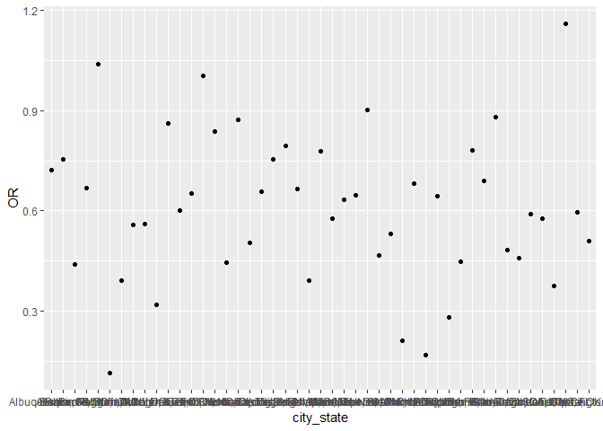

p8105\_hw6\_as5457
================
Sunny Siddique
November 24, 2018

Problem 1
=========

Create a city\_state variable (e.g. “Baltimore, MD”), and a binary variable indicating whether the homicide is solved. Omit cities Dallas, TX; Phoenix, AZ; and Kansas City, MO – these don’t report victim race. Also omit Tulsa, AL – this is a data entry mistake. Modifiy victim\_race to have categories white and non-white, with white as the reference category. Be sure that victim\_age is numeric.

``` r
library(tidyverse)
```

    ## -- Attaching packages ----------------------------------------- tidyverse 1.2.1 --

    ## v ggplot2 3.0.0     v purrr   0.2.5
    ## v tibble  1.4.2     v dplyr   0.7.6
    ## v tidyr   0.8.1     v stringr 1.3.1
    ## v readr   1.1.1     v forcats 0.3.0

    ## -- Conflicts -------------------------------------------- tidyverse_conflicts() --
    ## x dplyr::filter() masks stats::filter()
    ## x dplyr::lag()    masks stats::lag()

``` r
homicide_data = read_csv("./homicide-data.csv") %>% 
  janitor::clean_names()
```

    ## Parsed with column specification:
    ## cols(
    ##   uid = col_character(),
    ##   reported_date = col_integer(),
    ##   victim_last = col_character(),
    ##   victim_first = col_character(),
    ##   victim_race = col_character(),
    ##   victim_age = col_character(),
    ##   victim_sex = col_character(),
    ##   city = col_character(),
    ##   state = col_character(),
    ##   lat = col_double(),
    ##   lon = col_double(),
    ##   disposition = col_character()
    ## )

``` r
homicide_clean = homicide_data %>% 
  mutate(city_state = str_c(city, state, sep = ", "),
         solved = as.numeric (disposition == "Closed by arrest")) %>% 
  filter(!city_state %in% c("Dallas, TX","Phoenix, AZ", "Kansas City, MO", "Tulsa, AL")) %>% 
  mutate (victim_race = recode(victim_race, "White" = "white", "Hispanic" = "non-white", "Other" = "non-white", "Black" = "non-white", "Asian" = "non-white")) %>% 
  mutate(victim_race = fct_relevel(victim_race, "white")) %>% 
  mutate(victim_age = as.numeric(victim_age))
```

    ## Warning in evalq(as.numeric(victim_age), <environment>): NAs introduced by
    ## coercion

``` r
class(homicide_clean$victim_age)
```

    ## [1] "numeric"

For the city of Baltimore, MD, use the glm function to fit a logistic regression with resolved vs unresolved as the outcome and victim age, sex and race (as just defined) as predictors. Save the output of glm as an R object; apply the broom::tidy to this object; and obtain the estimate and confidence interval of the adjusted odds ratio for solving homicides comparing non-white victims to white victims keeping all other variables fixed.

``` r
baltimore_logistic = homicide_clean %>% 
  filter(city_state == "Baltimore, MD") %>% 
  glm(solved ~ victim_age + victim_sex + victim_race, data = ., family = binomial())
baltimore_logistic
```

    ## 
    ## Call:  glm(formula = solved ~ victim_age + victim_sex + victim_race, 
    ##     family = binomial(), data = .)
    ## 
    ## Coefficients:
    ##          (Intercept)            victim_age        victim_sexMale  
    ##              1.18603              -0.00699              -0.88779  
    ## victim_racenon-white  
    ##             -0.81960  
    ## 
    ## Degrees of Freedom: 2826 Total (i.e. Null);  2823 Residual
    ## Null Deviance:       3676 
    ## Residual Deviance: 3597  AIC: 3605

``` r
baltimore_logistic %>% 
  broom::tidy() %>% 
  mutate(OR = exp(estimate),
         lower_bound = exp(estimate - std.error*1.96), upper_bound = exp(estimate + std.error*1.96))
```

    ## # A tibble: 4 x 8
    ##   term estimate std.error statistic  p.value    OR lower_bound upper_bound
    ##   <ch>    <dbl>     <dbl>     <dbl>    <dbl> <dbl>       <dbl>       <dbl>
    ## 1 (In~  1.19      0.235        5.06 4.30e- 7 3.27        2.07        5.19 
    ## 2 vic~ -0.00699   0.00326     -2.14 3.22e- 2 0.993       0.987       0.999
    ## 3 vic~ -0.888     0.136       -6.53 6.80e-11 0.412       0.315       0.537
    ## 4 vic~ -0.820     0.175       -4.69 2.68e- 6 0.441       0.313       0.620

The odds of a non-white person's case being solved is 0.441 times the odds of a white person's case being solved. We are 95% confident that the true odds ratio falls between 0.313 and 0.620.

Now run glm for each of the cities in your dataset, and extract the adjusted odds ratio (and CI) for solving homicides comparing non-white victims to white victims. Do this within a “tidy” pipeline, making use of purrr::map, list columns, and unnest as necessary to create a dataframe with estimated ORs and CIs for each city.

``` r
all_cities = homicide_clean %>% 
  group_by(city_state) %>% 
  nest() %>% 
  mutate(cities = map(data, ~glm(solved ~ victim_age + victim_sex + victim_race, data = .x, family = binomial())),
    cities = map(cities, broom::tidy)) %>% 
   select(-data) %>% 
  unnest() %>% 
  filter(term == "victim_racenon-white") %>% 
  mutate(OR = exp(estimate),
         conf_low = exp(estimate - std.error*1.96),
         conf_high = exp(estimate + std.error*1.96)) %>%
  select(city_state, term, log_OR = estimate, OR, conf_low, conf_high, p.value)
all_cities
```

    ## # A tibble: 47 x 7
    ##    city_state     term            log_OR    OR conf_low conf_high  p.value
    ##    <chr>          <chr>            <dbl> <dbl>    <dbl>     <dbl>    <dbl>
    ##  1 Albuquerque, ~ victim_raceno~ -0.324  0.723   0.438      1.19   2.06e-1
    ##  2 Atlanta, GA    victim_raceno~ -0.284  0.753   0.432      1.31   3.17e-1
    ##  3 Baltimore, MD  victim_raceno~ -0.820  0.441   0.313      0.620  2.68e-6
    ##  4 Baton Rouge, ~ victim_raceno~ -0.404  0.668   0.313      1.43   2.96e-1
    ##  5 Birmingham, AL victim_raceno~  0.0385 1.04    0.615      1.76   8.86e-1
    ##  6 Boston, MA     victim_raceno~ -2.15   0.116   0.0480     0.282  1.96e-6
    ##  7 Buffalo, NY    victim_raceno~ -0.936  0.392   0.214      0.719  2.47e-3
    ##  8 Charlotte, NC  victim_raceno~ -0.584  0.558   0.321      0.969  3.83e-2
    ##  9 Chicago, IL    victim_raceno~ -0.576  0.562   0.431      0.733  2.07e-5
    ## 10 Cincinnati, OH victim_raceno~ -1.14   0.318   0.184      0.551  4.28e-5
    ## # ... with 37 more rows

Create a plot that shows the estimated ORs and CIs for each city. Organize cities according to estimated OR, and comment on the plot.

``` r
all_cities %>% 
  mutate(city_state = fct_reorder(city_state, OR)) %>%
  ggplot(aes(x = city_state, y = OR)) + geom_point() +
  geom_errorbar(mapping = aes(ymin = conf_low, ymax = conf_high)) +
  theme(axis.text.x = element_text(angle = 90, hjust = 1)) +
  labs (
    title = "Estimated ORs and CIs",
        x = "City",
        y = "Estimate"
  )
```



COMMENT
=======

Problem 2
---------

Load and clean the data for regression analysis (i.e. convert numeric to factor where appropriate, check for missing data, etc.).

``` r
birthweight = read_csv("./birthweight.csv") %>% 
  janitor::clean_names()
```

    ## Parsed with column specification:
    ## cols(
    ##   .default = col_integer(),
    ##   gaweeks = col_double(),
    ##   ppbmi = col_double(),
    ##   smoken = col_double()
    ## )

    ## See spec(...) for full column specifications.
